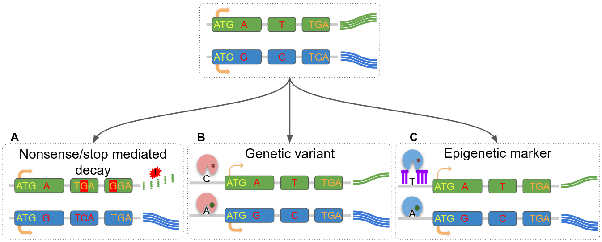
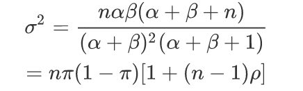
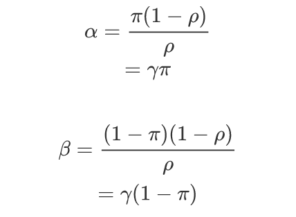
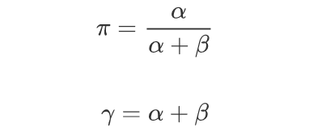
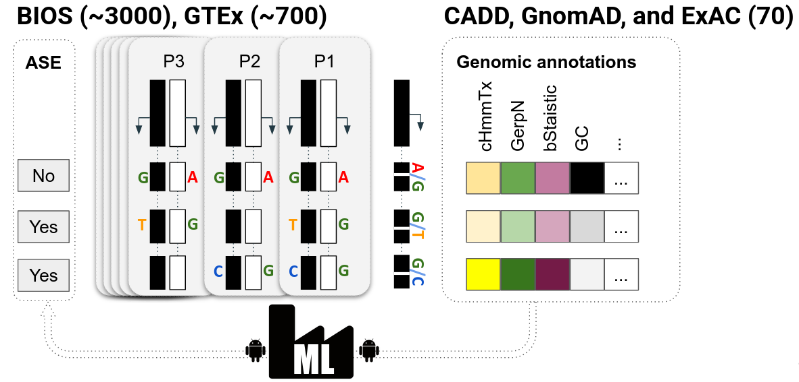

# Allele specific expression analysis on 3475 blood samples

## Backgrounds

### Definition
Allele-Specific Expression(ASE, Allelic Imbalance or Allelic Expression) refers the phenomenon that various abundance of transcripts from maternal and paternal alleles at heterozygous loci in diploid organisms.

### Causation
Genetic variants (e.g. `eQTL`), epigenetic markers (e.g. `eQTM`), non-sense mediated decay(i.e. `NMD`) and alternative splicing etc.



### Measurements  
- Allele-specific PCR
- Fluorescence in situ hybridization (`FISH`)
- Array-based method
- RNA sequencing 

### Applications
- Cancer
- Brain development
- Heart diseases

## Measurement of ASE effects in this study
In previous studies, there many different method to estimate the ASE effects at different level.

### Binomial model
We assume the outcomes of each individual for each locus are independent and identical distributed(*i.i.d.*).
Generally, for the observed locus, a simple distribution of allele-specific expression result is respected to Binomial distribution.


Where `k` is the amount of success and means the abundance of alternative alleles in our case.
We use a maximum likelihood estimation (`MLE`) under a Binomial distribution to estimate the parameter **θ** at first.
Then a log-likelihood ratio test (`LRT`) was done to determine the goodness of fit to the balanced model in which the expression of two are identical or gently different(i.e. **θ = 0.5**).

### Beta-Binomial model

However, the **θ** could be various. And we assume **θ** is respect to a Beta distribution.


Then the joint distribution is a Beta-Binomial distribution.

In Beta-Binomial distribution, let **π=α/(α+β)** the mean is


While let **ρ=1/(α+β+1)**, then the variance is



The π here is the mean probability of success in Bernoulli trials, while the **ρ** is the over-dispersion of the distribution.

In our problem, we need to estimate π and ρ for null and alternative hypothesis.

First, we need to know the relation among **π, ρ, α, β**.
Let **λ=(1-ρ)/ρ**



Correspondingly,



Then, we use **π, λ** as the variables of our likelihood function, where **π** is the probability of success, and **λ** is the over-dispersion parameter.
Here is our null model: **π=0.5, λ=100** which means the probability of success is 0.5 and less over-dispersion.

## Pipeline to predict ASE effects by machine learning
One of goals in this studies is to connect the DNA annotations and ASE effects by machine learning. The following steps are standard pipeline to construct an ASE prediction model from allelic read counts. The overview of the pipeline could be depicted by the following figure.



### Step 0 Work directory tree and dependencies

#### Working directory

To walk through the pipeline, we suppose there is a working directory structured as the following. All steps are supposed to be done in `working_dir` which is the working directory for the project.

```
working_dir
├── inputs                                 # Input files
│   ├── BiosHeterozygousLociRefGRCh37.vcf  # Input files for step 2, cohort BIOS
│   └── GtexHeterozygousLociRefGRCh37.vcf  # Input files for step 2, cohort GTEx
├── misc                                   # Miscellaneous
├── outputs                                # Outputs, including temporary files
│   ├── asePredModel                       # Trained models
│   ├── aseQuanEffect                      # Quantification of ASE effects
│   ├── aseApplication                     # Apply the trained model on new data
│   └── caddAnnotation                     # Annotations by CADD
└── scripts                                # Scripts
    ├── asepred.py                         # Python script to train the model
    └── asequan.r                          # R script to quantify ASE for each variant
```

#### Pipeline dependencies

`asepred.py` is a Python3 script depending on the following packages. However, it's possible to use newer packages, but not recommended 

```yaml
scipy == 1.1.0
numpy == 1.15.3
pandas == 0.23.4
joblib == 0.12.5
matplotlib == 3.0.0
scikit-learn == 0.20.0
imbalanced-learn == 0.4.0
```

`asequan.r` is a R script depending on the following packages.

```
dplyr
```

### Step 1 Allelic read counts

The allelic read counts were generated by a cornerstone study (de Klein et al. bioRxiv 2020) for our study. More information can be found at [bioRxiv](https://doi.org/10.1101/2020.09.19.300095)

### Step 2 Genomic annotation

We annotated each variant using `CADD` (version 1.4, reference GRCh37) by the following commandline. To speed up the calculation, we deployed pre-computed CADD score database and requested the annotation by flag `-a`.

```bash
# We used a tmp-dir to store large temporary files by CADD.sh
# BIOS cohort
CADD.sh -a \
	-g GRCh37
	-o outputs/caddAnnotation/BiosHeterozygousLociAnnotatedByCADDRefGRCh37.tsv.gz \
	-t tmp-dir \
	inputs/BiosHeterozygousLociRefGRCh37.vcf

# GTEx cohort
CADD.sh -a \
	-g GRCh37
	-o outputs/caddAnnotation/GtexHeterozygousLociAnnotatedByCADDRefGRCh37.tsv.gz \
	-t tmp-dir \
	inputs/GtexHeterozygousLociRefGRCh37.vcf
```

### Step 3 Quantification of allele-specific expression effects for each variant

Here we suppose allelic read counts is respect to beta-binomial distribution and estimated the its parameters using ML. Then we decided whether there is an ASE effect by hypothesis test of likelihood ratio test. The implementation was powered by R language and could be found at `asequan.r`. 

```bash
# BIOS data
unzip outputs/caddAnnotation/BiosHeterozygousLociAnnotatedByCADDRefGRCh37.tsv.gz
Rscript scripts/asequan.r \
	outputs/caddAnnotation/BiosHeterozygousLociAnnotatedByCADDRefGRCh37.tsv \
	outputs/aseQuanEffect/BiosHeterozygousLociAnnotatedByCADDRefGRCh37ASEEffects.tsv

# GTEx data
unzip outputs/caddAnnotation/GtexHeterozygousLociAnnotatedByCADDRefGRCh37.tsv.gz
Rscript scripts/asequan.r \
	outputs/caddAnnotation/GtexHeterozygousLociAnnotatedByCADDRefGRCh37.tsv \
	outputs/aseQuanEffect/GtexHeterozygousLociAnnotatedByCADDRefGRCh37ASEEffects.tsv
```

### Step 4 Model training (BIOS cohort)

We exploited four algorithms[^1] to train a model to predict SNP ASE by the corresponding genomic annotations. The following code is an exampled to train a model:

1. using 90% data and test the model on 10% data (`--test-proportion 0.1`)
2. using gradient boosting tree  (`--classifier gbc`)
3. using 10-fold cross validation (`--outer-cvs 10`)
4. using variants carried at least by five individuals (`--min-group-size 5`)

```bash
python3 asepred.py train \
    --test-proportion 0.1 \
	--classifier gbc \
	--outer-cvs 10 \
 	--min-group-size 5 \
 	--input-file outputs/aseQuanEffect/BiosHeterozygousLociAnnotatedByCADDRefGRCh37ASEEffects.tsv \
	--output-prefix outputs/asePredModel/biosModel/bios-
```

The commandline will generate nine files named with prefix "outputs/BIOS-" (by `--output-prefix`, make sure the directory is existed). The file tree looks as the following.

```
outputs/asePredModel/biosModel/
├── bios-train_model.pkl                    # Model
├── bios-train_report.pkl                   # Evaludation matrix
├── bios-train_feature_importances.pkl      # Feature importance for the model
├── bios-train_feature_importances_hist.png # Feature importance figure from train_feature_importance.pkl
├── bios-train_auc_fpr_tpr.pkl              # Train AUC, FPR/TPR for evaluation
├── bios-train_roc_curve.png                # ROC/AUC figure from train_auc_fpr_tpr.pkl
├── bios-test_output.csv                    # Test output
├── bios-test_auc_fpr_tpr.pkl               # Test AUC, FPR/TPR for evaluation
└── bios-test_roc_curve.png                 # ROC/AUC figure from test_auc_fpr_tpr.pkl
```

### Step 5 Model validation (optional)

To evaluate our models, we used an independent dataset (GTEx) to validate the model. And we also did the other way around, i.e. train the model using GTEx dataset and validate it on BIOS dataset. The following code is an example using subcommand `validate`.

```bash
python3 scripts/asepred.py validate \
	--input-file  \
	--model-file outputs/asePredModel/biosModel/bios-train_model.pkl \
	--output-prefix outputs/asePredModel/biosModel/gtex-
```

### Step 6 Model application

Another important subcommand of `asepred.py` is `predict` that for the prediction of new data. Here is an usage example. Please note, you have to make sure features in the new data are the same as used in the model training.

```bash
python3 scripts/asepred.py preidct \
	--input-file outputs/aseQuanEffect/GtexHeterozygousLociAnnotatedByCADDRefGRCh37ASEEffects.tsv \
    --model-file outputs/asePredModel/biosModel/bios-train_model.pkl \
    --output-prefix outputs/aseApplication/biosModelPredictGtexData-
```

## Todo list
- [ ] If the `--nested-cv` is not given, then the scripts picks up a model fitted by `RandomizedSearchCV` as a estimator for the cross validation. In this case, the validation is called outer validation, which enables the script to draw a ROC-AUC plot. However, th training report will be useless as it only records the report of the first fitting. (The code should be modified to fix this potential problem)

## Footnotes

[^1]: Including Gradient Boosting tree (`gbc`), Ada boost (`abc`), Random Forest (`rfc`) and Balanced Random Forest (`brfc`).
